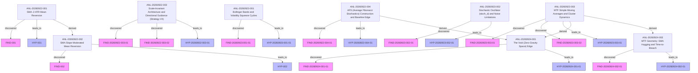

# Knowledge Lineage & Hypothesis Graph

> This document is automatically generated by `tools/kb.py index`. Do not edit directly.

```mermaid
graph TD
    ANL_20260922_001["ANL-20260922-001<br/>SMA -2 ATR Mean Reversion"]
    FIND_001["FIND-001"]
    ANL_20260922_001 -->|discovered| FIND_001
    style FIND_001 fill:#f9f,stroke:#333
    HYP_001["HYP-001"]
    ANL_20260922_001 -->|leads_to| HYP_001
    style HYP_001 fill:#bbf,stroke:#333
    ANL_20260922_002["ANL-20260922-002<br/>SMA Slope Moderated Mean Reversion"]
    ANL_20260922_001 -->|derived| ANL_20260922_002
    FIND_002["FIND-002"]
    ANL_20260922_002 -->|discovered| FIND_002
    style FIND_002 fill:#f9f,stroke:#333
    HYP_002["HYP-002"]
    ANL_20260922_002 -->|leads_to| HYP_002
    style HYP_002 fill:#bbf,stroke:#333
    ANL_20260922_003["ANL-20260922-003<br/>Scale-Invariant Architecture and Directional Guidance (Strategy V4)"]
    FIND_20260922_003_01["FIND-20260922-003-01"]
    ANL_20260922_003 -->|discovered| FIND_20260922_003_01
    style FIND_20260922_003_01 fill:#f9f,stroke:#333
    FIND_20260922_003_02["FIND-20260922-003-02"]
    ANL_20260922_003 -->|discovered| FIND_20260922_003_02
    style FIND_20260922_003_02 fill:#f9f,stroke:#333
    HYP_20260922_003_01["HYP-20260922-003-01"]
    ANL_20260922_003 -->|leads_to| HYP_20260922_003_01
    style HYP_20260922_003_01 fill:#bbf,stroke:#333
    ANL_20260922_004["ANL-20260922-004<br/>AFS (Average Fibonacci Stochastics) Construction and Baseline Edge"]
    FIND_20260922_004_01["FIND-20260922-004-01"]
    ANL_20260922_004 -->|discovered| FIND_20260922_004_01
    style FIND_20260922_004_01 fill:#f9f,stroke:#333
    HYP_20260922_004_01["HYP-20260922-004-01"]
    ANL_20260922_004 -->|leads_to| HYP_20260922_004_01
    style HYP_20260922_004_01 fill:#bbf,stroke:#333
    ANL_20260923_001["ANL-20260923-001<br/>Bollinger Bands and Volatility Squeeze Cycles"]
    FIND_20260923_001_01["FIND-20260923-001-01"]
    ANL_20260923_001 -->|discovered| FIND_20260923_001_01
    style FIND_20260923_001_01 fill:#f9f,stroke:#333
    HYP_20260923_001_01["HYP-20260923-001-01"]
    ANL_20260923_001 -->|leads_to| HYP_20260923_001_01
    style HYP_20260923_001_01 fill:#bbf,stroke:#333
    ANL_20260923_002["ANL-20260923-002<br/>Stochastic Oscillator (stoch_d) and Noise Limitations"]
    FIND_20260923_002_01["FIND-20260923-002-01"]
    ANL_20260923_002 -->|discovered| FIND_20260923_002_01
    style FIND_20260923_002_01 fill:#f9f,stroke:#333
    HYP_20260923_002_01["HYP-20260923-002-01"]
    ANL_20260923_002 -->|leads_to| HYP_20260923_002_01
    style HYP_20260923_002_01 fill:#bbf,stroke:#333
    ANL_20260923_003["ANL-20260923-003<br/>MTF Simple Moving Averages and Cluster Dynamics"]
    FIND_20260923_003_01["FIND-20260923-003-01"]
    ANL_20260923_003 -->|discovered| FIND_20260923_003_01
    style FIND_20260923_003_01 fill:#f9f,stroke:#333
    FIND_20260923_003_02["FIND-20260923-003-02"]
    ANL_20260923_003 -->|discovered| FIND_20260923_003_02
    style FIND_20260923_003_02 fill:#f9f,stroke:#333
    HYP_20260923_003_01["HYP-20260923-003-01"]
    ANL_20260923_003 -->|leads_to| HYP_20260923_003_01
    style HYP_20260923_003_01 fill:#bbf,stroke:#333
    ANL_20260924_001["ANL-20260924-001<br/>The Void (Zero-Gravity Space) Edge"]
    ANL_20260922_004 -->|derived| ANL_20260924_001
    ANL_20260923_003 -->|derived| ANL_20260924_001
    FIND_20260924_001_01["FIND-20260924-001-01"]
    ANL_20260924_001 -->|discovered| FIND_20260924_001_01
    style FIND_20260924_001_01 fill:#f9f,stroke:#333
    HYP_20260924_001_01["HYP-20260924-001-01"]
    ANL_20260924_001 -->|leads_to| HYP_20260924_001_01
    style HYP_20260924_001_01 fill:#bbf,stroke:#333
    ANL_20260924_002["ANL-20260924-002<br/>MTF Geometry: SMA Hugging and Time-to-Breach"]
    ANL_20260923_003 -->|derived| ANL_20260924_002
    FIND_20260924_002_01["FIND-20260924-002-01"]
    ANL_20260924_002 -->|discovered| FIND_20260924_002_01
    style FIND_20260924_002_01 fill:#f9f,stroke:#333
    HYP_20260924_002_01["HYP-20260924-002-01"]
    ANL_20260924_002 -->|leads_to| HYP_20260924_002_01
    style HYP_20260924_002_01 fill:#bbf,stroke:#333
```
